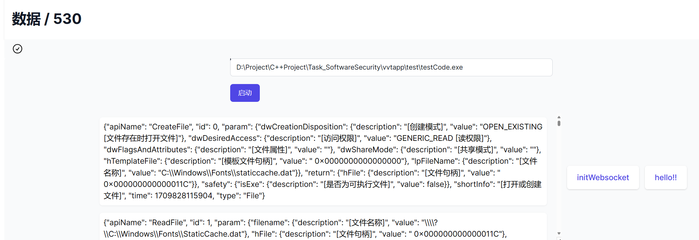
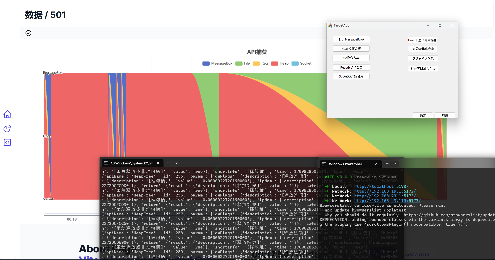
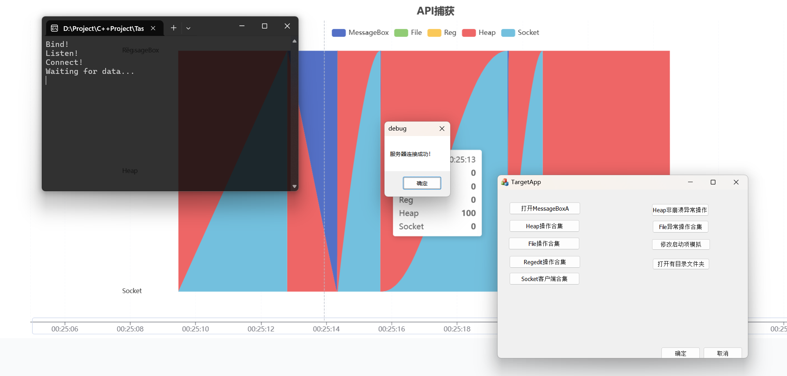
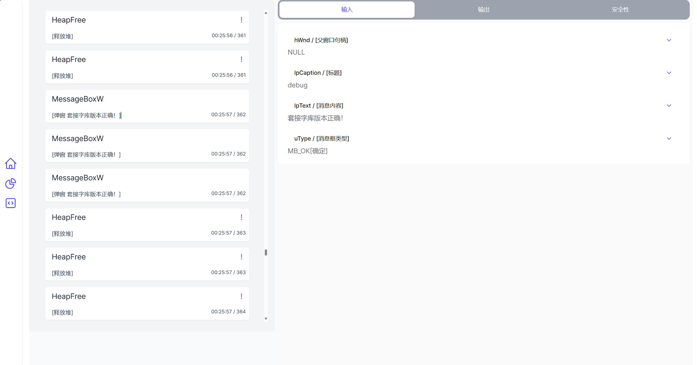

# API-Hook-app
## Abstract
> 对指定API的截获，对软件行为的分析。在API截获部分，需要截获的API类型有弹窗API，文件操作API，注册表操作API，堆操作API和网络通信API等；在软件行为分析部分，需要针对不同类型的API设计不同的判断算法，用以检测程序行为，例如堆申请和释放是否一致，是否修改了可执行文件，是否修改了开机自启动的注册表项等。界面设计用到了Vue框架，html，css，js等语言，通过npm配置好需要用到的包，包括一些需要的icon，可视化工具：echart，还有一些设计标题的插件，这里我们用到的是headlessui，还配置好基本的CSS来实现自己想要的风格，主体部分运用了TaliwindCSS中的flex组件实现基本的构局，利用@click函数实现一些基本的交互操作，利用echart插件实现对数据进行可视化的处理，将截获到的API进行统计并随着API数量的增加，逐步形成流层图，还通过js来编写一些函数实现对一些API进行过滤的操作。
## How to start

### Ⅰ. modify the root path 
- modify the `./injector/injector.cpp`
```cpp
wcscpy_s(DirPath, MAX_PATH, L"...\\DetoursDll\\x64\\Debug");
GetCurrentDirectory(MAX_PATH, DirPath);
char DLLPath[MAX_PATH + 1] = "...\\DetoursDll\\x64\\Debug\\DetoursDll.dll";
```
- compile the injector.cpp again，noticing Select the VC++ directory in the configuration properties, add the include folder path you just compiled to the include directory, and add lib.X86 to the library directory (for 64-bit systems, lib.X64).

- modify `./Backend/serverThread/websocketServer.py`
```python
if os.path.exists(message['path']):
  targetProcess = subprocess.Popen(["...\\injector\\x64\\Debug\\Injector.exe",message['path']],shell=True)    
  server.send_message(client, "start success")
  return
```
### Ⅱ. Start pipe
 
- cd Backend Dirpath 
- open cmd
- pip `requirements`
- input
    ```py
        python app.py
    ```
### Ⅲ. Web operation
- install npm and Vue
- cd Web DirPath
- open cmd
- input 
  ```npm
    npm run dev
  ```

### Ⅳ. TestProgram deploy

- click the ChartPieIcon
- click the Button
- Input the root path of testCode.exe 
- click the initWebsocket
- start to test
- socket test
  - open `TestProgram/socket/x64/socket.exe`
  - click **socket客户端合集**

## Demonstrate
- **Start**

- **Common API Test**

- **Socket Test**

- **Message Box**



